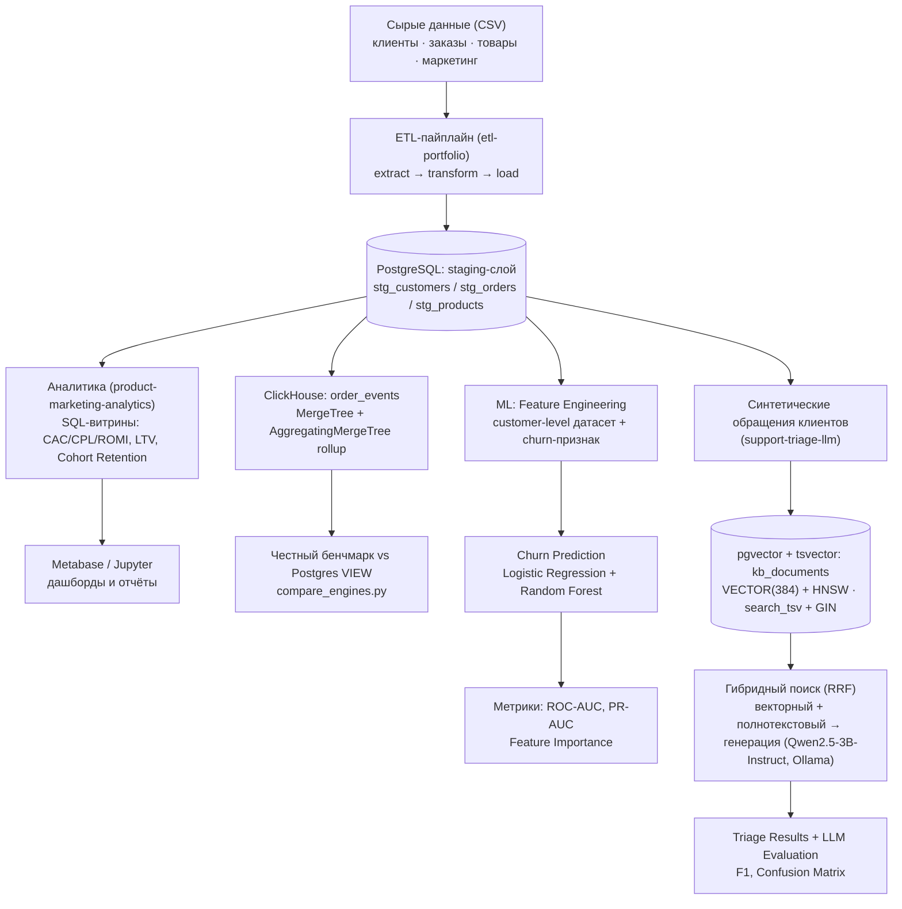

# Nikolay Kolesnikov — Data Engineering & Applied ML/LLM Portfolio Hub

## TL;DR

Спроектировал и реализовал связанную экосистему из трёх продакшн-ориентированных
репозиториев: единый ETL-пайплайн подготавливает данные для аналитических
витрин, предиктивной ML-модели оттока клиентов и LLM-триажа обращений с
production-грейд векторным поиском. Каждый компонент решает отдельную бизнес-
задачу (юнит-экономика каналов, удержание клиентов, автоматизация поддержки),
но опирается на общий, честно спроектированный слой данных — с индексами,
тестами и CI/CD, а не на изолированные демо-скрипты.

## 🏗 Архитектура системы



## 🛠 Технологический стек

**Data Engineering**
- PostgreSQL 17 (оконные функции, CTE, явные индексы на FK-колонках,
  MATERIALIZED VIEW + REFRESH CONCURRENTLY)
- ClickHouse (MergeTree, AggregatingMergeTree, MATERIALIZED VIEW с инкрементальным rollup)
- Python: pandas, SQLAlchemy, psycopg2, clickhouse-connect
- Паттерн ETL: extract / transform / load, идемпотентная загрузка
- pytest — юнит-тесты transform-логики и агрегаций

**ML/AI**
- scikit-learn — Logistic Regression, Random Forest, метрики (ROC-AUC, PR-AUC, classification_report)
- Ollama — локальный инференс Qwen2.5-3B-Instruct (генерация) и all-minilm (эмбеддинги), без внешних API
- pgvector — векторный тип данных и HNSW-индекс для поиска по эмбеддингам
- Гибридный поиск — векторный (pgvector) + полнотекстовый (tsvector/GIN),
  объединённые Reciprocal Rank Fusion
- pydantic — валидация структурированного вывода LLM с retry-логикой

**Infrastructure/Tools**
- Docker и Docker Compose — мультисервисные стенды (Ollama + PostgreSQL/pgvector + приложение)
- GitHub Actions — CI, прогон тестов при каждом пуше
- Jupyter (nbformat, nbconvert) — выполненные ноутбуки с реальными графиками
- Metabase — self-hosted BI-дашборд поверх витрин
- python-dotenv — конфигурация через переменные окружения, секреты вне репозитория

## 🏆 Ключевые технические достижения

- **Предотвратил утечку целевой переменной** в модели прогнозирования оттока:
  сознательно исключил из признаков `days_since_last_order`, поскольку именно
  на его основе строится целевая переменная `churned` — иначе метрики модели
  были бы фиктивно завышены.
- **Перевёл RAG-поиск на production-уровень**: заменил brute-force перебор
  косинусной близости на чистом Python (numpy) HNSW-индексом в PostgreSQL
  (расширение `pgvector`, тип `VECTOR(384)`) — релевантный контекст для LLM
  теперь достаётся одним SQL-запросом с использованием индекса, а не полным
  сканированием базы знаний в памяти приложения.
- **Внедрил количественную валидацию качества LLM** вместо оценки "на глаз":
  построил confusion matrix и F1-меры по классам (scikit-learn), что точно
  локализовало границы применимости 3B-модели — например, систематическую
  путаницу семантически близких категорий обращений вместо случайного шума.
- **Спроектировал индексацию с проверкой на реальном плане выполнения**:
  добавил индексы на все внешние ключи и колонки фильтрации, затем честно
  подтвердил `EXPLAIN ANALYZE` переход планировщика с `Seq Scan` на
  `Bitmap Index Scan` при росте объёма данных до 150 000 строк.
- **Добавил OLAP-слой (ClickHouse) рядом с Postgres и честно измерил разницу**:
  спроектировал `MergeTree`-таблицу и инкрементальную витрину на
  `AggregatingMergeTree` + `MATERIALIZED VIEW`, затем реальным бенчмарком
  (медиана из 20 прогонов) показал, что на объёме этого пет-проекта
  (~2000 строк) Postgres быстрее ClickHouse — включая его собственную
  инкрементальную витрину — и объяснил почему (фиксированные накладные
  расходы колоночного движка не окупаются на таком объёме), вместо того
  чтобы подогнать вывод под ожидаемый "ClickHouse быстрее".
- **Автоматизировал контроль качества кода**: настроил CI/CD (GitHub Actions)
  во всех трёх репозиториях — юнит-тесты прогоняются при каждом пуше,
  что предотвращает попадание регрессий в основную ветку без ручной проверки.
- **Соединил независимо посчитанные метрики из двух репозиториев в один
  бизнес-инсайт**: `product-marketing-analytics` показывает `referral` как
  канал с лучшим ROMI, `support-triage-llm` независимо — с наибольшей долей
  негативных/high-priority обращений в поддержку. Оба вывода честно
  ограничены малым n, но совпадающее направление в двух не связанных друг с
  другом расчётах — ровно тот сигнал, который отдельные "демо поверх одной
  таблицы" не могут показать: дешёвое привлечение не обязательно означает
  довольных клиентов.
- **Добавил гибридный поиск (RRF) в RAG и честно проверил, что именно он
  чинит**: объединил векторный поиск (pgvector) с полнотекстовым (`tsvector`/
  GIN) через Reciprocal Rank Fusion, что подняло accuracy классификации
  обращений с 0.69 до 0.71 на полном честном прогоне. По найденным
  документам проверил конкретную гипотезу об одной из ошибок модели — и
  выяснил, что смена найденного контекста её не исправила: часть путаницы
  оказалась собственным семантическим смещением 3B-модели, а не артефактом
  плохого поиска, как предполагалось раньше.
- **Материализовал витрины и честно измерил, где это окупается**: рядом с
  каждым VIEW добавил MATERIALIZED VIEW-версию с уникальным индексом (нужен
  для `REFRESH ... CONCURRENTLY`, не блокирующего чтение) и обновлением
  после прогона ETL, а не на каждый SELECT. Реальный замер показал разный
  выигрыш по витринам (~1.6x-16x) в зависимости от того, насколько тяжёлый
  у витрины план — не одно универсальное число, а объяснимая зависимость от
  конкретного запроса.

## 📦 Компоненты экосистемы

- **[etl-portfolio](https://github.com/exist-ty/etl-portfolio)** — надёжный
  ETL-пайплайн, превращающий "грязные" сырые данные интернет-магазина в
  проиндексированный staging-слой PostgreSQL, готовый к аналитике и ML.
- **[product-marketing-analytics](https://github.com/exist-ty/product-marketing-analytics)** —
  SQL-витрины юнит-экономики (CAC/CPL/ROMI, LTV, retention) с материализованными
  версиями, модель прогнозирования оттока клиентов и ClickHouse OLAP-слой с
  честным бенчмарком против Postgres поверх общего staging-слоя.
- **[support-triage-llm](https://github.com/exist-ty/support-triage-llm)** —
  автоматическая классификация и приоритизация обращений в поддержку локальной
  LLM с гибридным (векторный + полнотекстовый, RRF) RAG-поиском и
  количественной оценкой качества.

## 🚀 Быстрый старт

Три репозитория рассчитаны на совместное расположение в соседних директориях
(взаимные относительные ссылки на общую базу `etl_portfolio`):

```bash
git clone https://github.com/exist-ty/etl-portfolio.git
git clone https://github.com/exist-ty/product-marketing-analytics.git
git clone https://github.com/exist-ty/support-triage-llm.git
```

Для каждого репозитория — стандартный production-ready цикл:

```bash
python -m venv .venv && .venv\Scripts\activate
pip install -r requirements.txt
cp .env.example .env        # указать реальные креды, .env — вне git
pytest                       # проверить, что окружение готово
```

1. **etl-portfolio** — поднять PostgreSQL, применить `sql/schema.sql`,
   сгенерировать и загрузить данные (`python -m src.etl.pipeline`).
2. **product-marketing-analytics** — применить `sql/marts.sql`, поднять
   Metabase одной командой (`docker compose up -d`), обучить модель оттока
   (`python ml/train_churn_model.py`).
3. **support-triage-llm** — поднять `pgvector`-контейнер и Ollama
   (`docker compose up -d`), применить `sql/triage_schema.sql`, прогнать
   пайплайн триажа (`python scripts/run_triage.py`).

Секреты нигде не хардкожены — только через `.env`, чувствительные файлы
исключены `.gitignore`; каждый сервис контейнеризирован и поднимается
одной командой Docker Compose.
