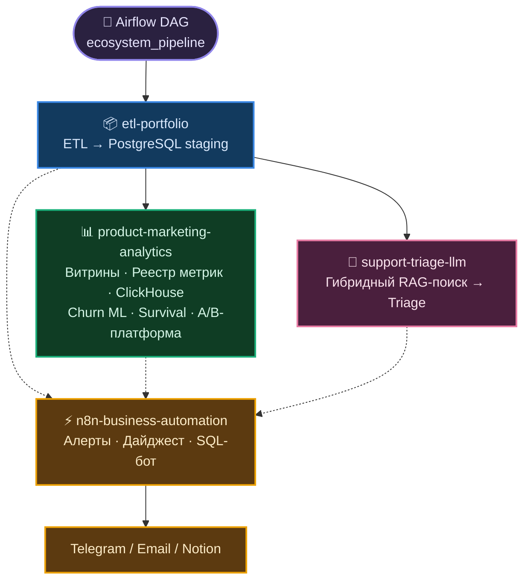
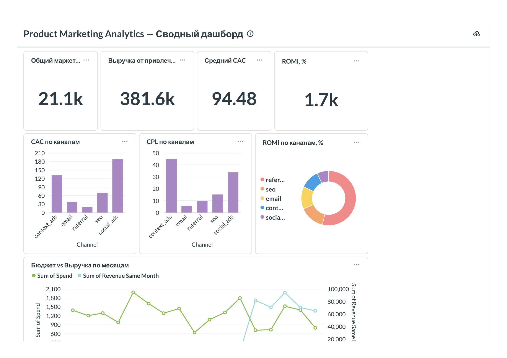

# Nikolay-Kolesnikov-portfolio-hub

## TL;DR

Спроектировал экосистему из пяти репозиториев: ETL → аналитические витрины
(плюс ClickHouse OLAP), ML-модель оттока, LLM-триаж с гибридным RAG-поиском,
экспериментальная платформа — каждый компонент решает свою бизнес-задачу
(юнит-экономика, удержание, поддержка), но опирается на общий, честно
спроектированный слой данных: индексы, тесты, CI/CD, а не демо-скрипты. Этот
репозиторий — не просто документация: Airflow-DAG оркестрирует весь пайплайн
и триггерит event-driven автоматизацию на n8n (алерты, Notion, Telegram-бот).

Поверх витрин — три аналитических слоя: реестр метрик, устраняющий расхождения
определений между дашбордом, ботом и ноутбуком; углублённая аналитика оттока
(survival-анализ с корректным цензурированием, RFM, когортная экономика);
экспериментальная платформа с always-valid p-values, CUPED и правилом
остановки. **220 тестов** по всей экосистеме, все проходят без поднятой БД и
без внешних сервисов: 179 в аналитическом репозитории, 20 в оркестраторе,
13 в LLM-триаже, 8 в ETL.

## 🏗 Архитектура системы

Сплошные стрелки — пайплайн-поток данных, пунктирные — "читается
напрямую" (n8n не встроен в DAG как ещё один шаг, а читает staging и
витрины по событию, см. ниже). n8n читает не только staging
(`etl-portfolio` — Data Quality Report, Notion-документация), но и
витрины `product-marketing-analytics` напрямую (Self-Service SQL-бот —
`GRANT SELECT` выдан именно на `mart_channel_economics`/`mart_customer_ltv`/
`mart_cohort_retention`, см. `sql/readonly_role_selfservice.sql` в
`n8n-business-automation`). Подробный разбор каждого узла —
[`docs/architecture.md`](docs/architecture.md).

## 🛠 Технологический стек

| Категория | Технологии |
|---|---|
| **Дата-инженерия** | PostgreSQL 17 (оконные функции, CTE, индексы на FK, `MATERIALIZED VIEW` + `REFRESH CONCURRENTLY`), ClickHouse (`MergeTree`, `AggregatingMergeTree`), pandas, SQLAlchemy, psycopg2, clickhouse-connect, pytest |
| **Аналитика** | Реестр метрик как единственный источник истины (генерация SQL из определений), RFM по естественным разрывам, survival-анализ оттока (Kaplan-Meier, log-rank, Cox PH) с обработкой цензурирования, когортная юнит-экономика; экспериментальная платформа: always-valid p-values (mSPRT), CUPED, SRM, guardrail-метрики |
| **ML и AI** | scikit-learn (Logistic Regression, Random Forest), Ollama (Qwen2.5-3B-Instruct + all-minilm, локальный инференс), pgvector + HNSW, гибридный поиск (RRF), pydantic, MLflow (трекинг экспериментов) |
| **Оркестрация** | Apache Airflow 2.10 (`LocalExecutor`), DAG на 16 задач через три репозитория + event-driven вызовы n8n; изолированный venv для тасков (см. [ADR 005](docs/adr/005-why-separate-venv-for-tasks.md)) |
| **Бизнес-автоматизация** | n8n (self-hosted, event-driven): алерты, AI-дайджест, Notion-документация, Self-Service SQL-бот; три разграниченные read-only роли PostgreSQL под разные поверхности атаки |
| **Инфраструктура** | Docker / Docker Compose, GitHub Actions CI, Jupyter (nbformat/nbconvert), Metabase, python-dotenv |

## 📊 Визуализации

<table>
<tr>
<td></td>
<td></td>
</tr>
<tr>
<td></td>
<td></td>
</tr>
</table>

Живой дашборд в Metabase (12 карточек: CAC/CPL/ROMI по каналам, LTV,
retention) — подробности и полные скриншоты в README
[`product-marketing-analytics`](https://github.com/exist-ty/product-marketing-analytics#дашборд).

## 🏆 Ключевые технические достижения

- **Нашёл девять расхождений в определениях метрик между репозиториями и
  устранил причину, а не следствия.** LTV, CAC, ROMI и retention были описаны
  независимо в четырёх местах — витринах, ноутбуке, SQL внутри n8n и карточках
  Metabase. Построчная сверка показала, что дайджест и дашборд считают разное:
  LTV усредняется по клиентам с заказами (витрина на `INNER JOIN`), а CAC рядом
  — по всем привлечённым, из-за чего **LTV/CAC систематически завышен**; три
  витрины работают с разными подмножествами заказов из-за разной трактовки
  заказов раньше регистрации; retention одной последней когорты подписан как
  `overall`. Решение — реестр метрик как единственный источник истины, из
  которого порождается SQL каждого потребителя
  ([`metrics/README.md`](https://github.com/exist-ty/product-marketing-analytics/blob/master/metrics/README.md)).
  Спорные пункты вынесены в открытые вопросы, а не решены за владельца
  продукта.

- **Показал числом, сколько стоит подглядывание в A/B-тест.** Детерминированная
  симуляция (300 экспериментов, 20 взглядов, эффекта нет): наивный повторяемый
  z-тест срабатывает в **24.7%** случаев при номинальных 5%, always-valid
  p-value (mSPRT) — в **2.0%**, и при этом сохраняет 100% мощности на эффекте
  +6 п.п. CUPED снижает стандартное отклонение оценки в 0.70 раза при
  теоретических `sqrt(1-ρ²)=0.71` — это прямо ослабляет вывод «нужно в 5 раз
  больше клиентов» из исходного power-анализа.

- **A/B-тест с честным power-анализом**: заложенная разница в конверсии
  (6% vs 11%, n=200) статистически не значима (p=0.205) — power-анализ
  показывает, что нужно ~5x больше клиентов, а не спрятанное за одной
  цифрой заключение. Саму формулу power-анализа дополнительно подтвердил
  1000 Monte-Carlo симуляций — не подгонка результата под красивый p.

- **Нашёл дефект собственной churn-модели через анализ дожития.** Бинарная
  постановка `churned = days_since_last_order > 90` помечает клиента с
  последним заказом 01.12.2025 как «не ушёл», хотя данные обрываются 31.12.2025
  и у него физически не было шанса набрать окно тишины. Это не лояльность, а
  отсутствие наблюдения. Kaplan-Meier с корректным правым цензурированием,
  log-rank и Cox PH отвечают не «уйдёт ли», а «когда».

- **Поймал вчетверо заниженную стандартную ошибку в собственной реализации
  Cox PH.** Модель опиралась на `hess_inv` от BFGS без аналитического
  градиента и давала SE 0.014 при фактических 0.049 — доверительные интервалы
  были бы фиктивными. Переписал на аналитический градиент и точную наблюдённую
  информационную матрицу через накопительные суммы по множествам риска: оценки
  сходятся, интервалы накрывают истинное значение на всех проверенных выборках,
  расчёт втрое быстрее.

- **Переосмыслил обоснование ClickHouse: граница проходит по форме нагрузки, а
  не по объёму.** Первая редакция ADR 004 честно измерила, что на 2000 заказов
  Postgres быстрее во всех трёх вариантах — и этой честностью подрывала смысл
  присутствия движка. Заказ — неизменяемое событие, клиент — изменяемая
  сущность, и это разделение верно на любом объёме. Плюс харнесс поиска **точки
  перелома** со свёрткой по масштабу, серверными метриками вместо клиентского
  wall time (именно он исказил первый замер) и двумя запросами, где Postgres
  обязан выигрывать всегда — вывод получается про разделение нагрузок, а не про
  «кто быстрее» ([ADR 004](docs/adr/004-why-clickhouse-alongside-postgres.md)).

- **Гибридный RAG (RRF) с количественной, а не приблизительной оценкой**:
  объединил векторный и полнотекстовый поиск, поднял accuracy классификации
  с 0.69 до 0.71 — и confusion-matrix анализом выяснил, что часть оставшихся
  ошибок не чинится лучшим поиском, а является собственным семантическим
  смещением 3B-модели.

- **Оркестрировал через Airflow и нашёл конфликт зависимостей до
  продакшна**: DAG на 16 задач одним прогоном через все репозитории.
  Установка зависимостей тасков в окружение самого Airflow сломала бы его
  веб-интерфейс (конфликт версий SQLAlchemy) — решение задокументировано в
  [ADR 005](docs/adr/005-why-separate-venv-for-tasks.md).

- **Прошёл собственный код ревью и починил девять проблем, включая отложенный
  отказ.** Дрейф-детектор делил разность средних на std наблюдений вместо
  стандартной ошибки и не мог сработать в принципе (`z = 0.04` при пороге 2.0).
  Health check возвращал ошибку на предупреждении и, стоя корнем графа,
  заблокировал бы все 16 задач в феврале 2027, когда замороженный датасет
  пересёк бы порог свежести. Три задачи заканчивались на `|| true` и не могли
  упасть никогда — лежащий n8n выглядел бы зелёным. Подробности —
  [`docs/orchestration.md`](docs/orchestration.md).

## 📦 Компоненты экосистемы

- [`etl-portfolio`](https://github.com/exist-ty/etl-portfolio) — ETL:
  "грязные" сырые данные → проиндексированный staging-слой PostgreSQL.
- [`product-marketing-analytics`](https://github.com/exist-ty/product-marketing-analytics) —
  SQL-витрины юнит-экономики, ClickHouse OLAP, churn-модель; реестр метрик как
  единственный источник истины, survival-анализ и RFM, экспериментальная
  платформа (mSPRT, CUPED, SRM, guardrail-метрики).
- [`support-triage-llm`](https://github.com/exist-ty/support-triage-llm) —
  триаж обращений локальной LLM с гибридным RAG-поиском.
- [`n8n-business-automation`](https://github.com/exist-ty/n8n-business-automation) —
  event-driven автоматизация: алерты, дайджест, Self-Service SQL-бот.
- **Этот репозиторий** — Airflow DAG, оркестрирующий четыре репозитория выше.

Полный разбор каждого — [`docs/architecture.md`](docs/architecture.md).

## 📚 Документация

- [`docs/quickstart.md`](docs/quickstart.md) — быстрый старт всех репозиториев.
- [`docs/architecture.md`](docs/architecture.md) — архитектура и компоненты подробно.
- [`docs/orchestration.md`](docs/orchestration.md) — Airflow DAG, найденные конфликты, честные результаты прогонов.
- [`docs/business-automation.md`](docs/business-automation.md) — n8n-автоматизация.
- [`docs/adr/`](docs/adr/) — Architecture Decision Records: почему Airflow, почему Ollama, почему RRF, почему ClickHouse рядом с Postgres, почему отдельный venv для тасков.
- [`docs/case_studies/`](docs/case_studies/) — четыре разбора (Problem → Investigation → Solution → Lesson Learned): три технических инцидента (конфликт версий SQLAlchemy, ClickHouse медленнее ожидаемого, non-determinism LLM-триажа) и один продуктовый — какой канал привлечения сокращать.
- [`docs/roadmap.md`](docs/roadmap.md) — две части: отложенное осознанно (Spark, Kafka, Kubernetes, vLLM/TGI, S3+Iceberg, Grafana) с триггерами перехода и следующие шаги (dbt, инкрементальность и backfill, SCD2, контракты данных, OpenLineage, CI с живой БД).
