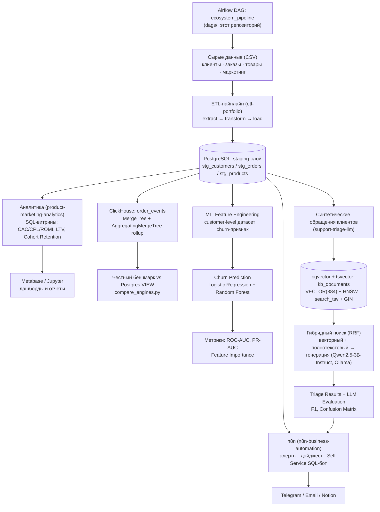

# Nikolay Kolesnikov — Data Engineering & Applied ML/LLM Portfolio Hub


## TL;DR

Спроектировал и реализовал связанную экосистему из трёх продакшн-ориентированных
репозиториев: единый ETL-пайплайн подготавливает данные для аналитических
витрин, предиктивной ML-модели оттока клиентов и LLM-триажа обращений с
production-грейд векторным поиском. Каждый компонент решает отдельную бизнес-
задачу (юнит-экономика каналов, удержание клиентов, автоматизация поддержки),
но опирается на общий, честно спроектированный слой данных — с индексами,
тестами и CI/CD, а не на изолированные демо-скрипты. Этот репозиторий — не
только документация: здесь же живёт Airflow-DAG, реально оркестрирующий
полный пайплайн через все три репозитория одним прогоном.

## 🏗 Архитектура системы



## 🛠 Технологический стек

**Data Engineering**
- PostgreSQL 17 (оконные функции, CTE, явные индексы на FK-колонках,
  MATERIALIZED VIEW + REFRESH CONCURRENTLY)
- ClickHouse (MergeTree, AggregatingMergeTree, MATERIALIZED VIEW с инкрементальным rollup)
- Python: pandas, SQLAlchemy, psycopg2, clickhouse-connect
- Паттерн ETL: extract / transform / load, идемпотентная загрузка
- pytest — юнит-тесты transform-логики и агрегаций

**ML/AI**
- scikit-learn — Logistic Regression, Random Forest, метрики (ROC-AUC, PR-AUC, classification_report)
- Ollama — локальный инференс Qwen2.5-3B-Instruct (генерация) и all-minilm (эмбеддинги), без внешних API
- pgvector — векторный тип данных и HNSW-индекс для поиска по эмбеддингам
- Гибридный поиск — векторный (pgvector) + полнотекстовый (tsvector/GIN),
  объединённые Reciprocal Rank Fusion
- pydantic — валидация структурированного вывода LLM с retry-логикой

**Orchestration**
- Apache Airflow 2.10 (LocalExecutor) — DAG на 9 задач через три репозитория,
  реальные зависимости вместо ручного "сначала запусти это, потом то" из README
- Изолированный venv для тасков отдельно от окружения самого Airflow (см.
  «Ключевые технические достижения» — реальный конфликт версий SQLAlchemy)

**Business Automation**
- n8n (Docker, self-hosted) — event-driven обвязка вокруг Airflow: алерты
  об ошибках/дрейфе данных в Telegram/Email, еженедельный AI-дайджест
  (Ollama-сводка поверх реальных дельт), Notion-документация витрин,
  Self-Service Analytics Bot (натуральный язык → SQL → выполнение)
- Три разграниченные read-only роли PostgreSQL под разные поверхности
  атаки (доверенный Airflow-вызов vs недоверенный ввод LLM-бота) —
  `default_transaction_read_only`, `statement_timeout`, GRANT только на
  агрегированные витрины для бота

**Infrastructure/Tools**
- Docker и Docker Compose — мультисервисные стенды (Ollama + PostgreSQL/pgvector + приложение)
- GitHub Actions — CI, прогон тестов при каждом пуше
- Jupyter (nbformat, nbconvert) — выполненные ноутбуки с реальными графиками
- Metabase — self-hosted BI-дашборд поверх витрин
- python-dotenv — конфигурация через переменные окружения, секреты вне репозитория

## 🏆 Ключевые технические достижения

- **Предотвратил утечку целевой переменной** в модели прогнозирования оттока:
  сознательно исключил из признаков `days_since_last_order`, поскольку именно
  на его основе строится целевая переменная `churned` — иначе метрики модели
  были бы фиктивно завышены.
- **Перевёл RAG-поиск на production-уровень**: заменил brute-force перебор
  косинусной близости на чистом Python (numpy) HNSW-индексом в PostgreSQL
  (расширение `pgvector`, тип `VECTOR(384)`) — релевантный контекст для LLM
  теперь достаётся одним SQL-запросом с использованием индекса, а не полным
  сканированием базы знаний в памяти приложения.
- **Внедрил количественную валидацию качества LLM** вместо оценки "на глаз":
  построил confusion matrix и F1-меры по классам (scikit-learn), что точно
  локализовало границы применимости 3B-модели — например, систематическую
  путаницу семантически близких категорий обращений вместо случайного шума.
- **Спроектировал индексацию с проверкой на реальном плане выполнения**:
  добавил индексы на все внешние ключи и колонки фильтрации, затем честно
  подтвердил `EXPLAIN ANALYZE` переход планировщика с `Seq Scan` на
  `Bitmap Index Scan` при росте объёма данных до 150 000 строк.
- **Добавил OLAP-слой (ClickHouse) рядом с Postgres и честно измерил разницу**:
  спроектировал `MergeTree`-таблицу и инкрементальную витрину на
  `AggregatingMergeTree` + `MATERIALIZED VIEW`, затем реальным бенчмарком
  (медиана из 20 прогонов) показал, что на объёме этого пет-проекта
  (~2000 строк) Postgres быстрее ClickHouse — включая его собственную
  инкрементальную витрину — и объяснил почему (фиксированные накладные
  расходы колоночного движка не окупаются на таком объёме), вместо того
  чтобы подогнать вывод под ожидаемый "ClickHouse быстрее".
- **Автоматизировал контроль качества кода**: настроил CI/CD (GitHub Actions)
  во всех четырёх репозиториях — юнит-тесты (три репозитория с бизнес-логикой)
  и валидация DAG/docker-compose (этот репозиторий, где тестировать по сути
  нечего кроме конфигурации) прогоняются при каждом пуше, что предотвращает
  попадание регрессий в основную ветку без ручной проверки.
- **Соединил независимо посчитанные метрики из двух репозиториев в один
  бизнес-инсайт**: `product-marketing-analytics` показывает `referral` как
  канал с лучшим ROMI, `support-triage-llm` независимо — с наибольшей долей
  негативных/high-priority обращений в поддержку. Оба вывода честно
  ограничены малым n, но совпадающее направление в двух не связанных друг с
  другом расчётах — ровно тот сигнал, который отдельные "демо поверх одной
  таблицы" не могут показать: дешёвое привлечение не обязательно означает
  довольных клиентов.
- **Добавил гибридный поиск (RRF) в RAG и честно проверил, что именно он
  чинит**: объединил векторный поиск (pgvector) с полнотекстовым (`tsvector`/
  GIN) через Reciprocal Rank Fusion, что подняло accuracy классификации
  обращений с 0.69 до 0.71 на полном честном прогоне. По найденным
  документам проверил конкретную гипотезу об одной из ошибок модели — и
  выяснил, что смена найденного контекста её не исправила: часть путаницы
  оказалась собственным семантическим смещением 3B-модели, а не артефактом
  плохого поиска, как предполагалось раньше.
- **Материализовал витрины и честно измерил, где это окупается**: рядом с
  каждым VIEW добавил MATERIALIZED VIEW-версию с уникальным индексом (нужен
  для `REFRESH ... CONCURRENTLY`, не блокирующего чтение) и обновлением
  после прогона ETL, а не на каждый SELECT. Реальный замер показал разный
  выигрыш по витринам (~1.6x-16x) в зависимости от того, насколько тяжёлый
  у витрины план — не одно универсальное число, а объяснимая зависимость от
  конкретного запроса.
- **Оркестрировал весь пайплайн через Airflow и нашёл реальный конфликт
  зависимостей до продакшна, а не после**: DAG на 9 задач гоняет все три
  репозитория одним прогоном (Docker — Airflow официально не поддерживает
  Windows). Установка зависимостей задач прямо в окружение Airflow сломала
  бы его веб-интерфейс — Airflow 2.x жёстко требует `sqlalchemy<2.0`
  (Flask-AppBuilder), а репозиториям нужен `sqlalchemy>=2.0`. Решение —
  отдельный venv для тасков, не для контрол-плейна. Полный честный прогон
  (9/9 задач успешно, LocalExecutor реально выполнил 4 независимые ветки
  параллельно) вскрыл два дополнительных честных наблюдения: (1) шаг с
  LLM-инференсом занял ~51 минуту вместо задокументированных ~24 —
  правдоподобная причина: Airflow-стек и CPU-инференс Ollama конкурируют за
  ограниченные CPU/RAM этой машины (8GB RAM — уже известное ограничение,
  см. `support-triage-llm`); (2) повторный прогон синтетических данных на
  n=45 дал другую accuracy (0.73 против 0.69/0.71 в предыдущих прогонах) и
  другой "лидирующий" по жалобам канал — конкретное, воспроизведённое
  подтверждение уже задокументированной оговорки "n=45 не статистически
  значимо", а не гипотетическое.
- **Спроектировал Self-Service SQL-бота с тремя независимыми слоями
  защиты и проверил каждый эмпирически, а не на словах**: отдельная,
  более узкая read-only роль (`GRANT SELECT` только на агрегированные
  витрины — не на сырые таблицы с PII), `default_transaction_read_only`
  и `statement_timeout=5s`. Подтвердил на реальной БД: попытка прочитать
  `stg_customers.email` падает с `permission denied`, `INSERT` — с
  `cannot execute INSERT in a read-only transaction`, `pg_sleep(10)`
  прерывается ровно на 5-й секунде. Также нашёл нетривиальный факт:
  локальная 3B-модель почти всегда отвечала "не могу" на решаемые
  вопросы, если инструкции были на русском, и стабильно генерировала
  корректный SQL при инструкциях на английском (сам вопрос пользователя
  остаётся на русском) — некритичный, но неожиданный language-effect.

## 📦 Компоненты экосистемы

- **[etl-portfolio](https://github.com/exist-ty/etl-portfolio)** — надёжный
  ETL-пайплайн, превращающий "грязные" сырые данные интернет-магазина в
  проиндексированный staging-слой PostgreSQL, готовый к аналитике и ML.
- **[product-marketing-analytics](https://github.com/exist-ty/product-marketing-analytics)** —
  SQL-витрины юнит-экономики (CAC/CPL/ROMI, LTV, retention) с материализованными
  версиями, модель прогнозирования оттока клиентов и ClickHouse OLAP-слой с
  честным бенчмарком против Postgres поверх общего staging-слоя.
- **[support-triage-llm](https://github.com/exist-ty/support-triage-llm)** —
  автоматическая классификация и приоритизация обращений в поддержку локальной
  LLM с гибридным (векторный + полнотекстовый, RRF) RAG-поиском и
  количественной оценкой качества.
- **[n8n-business-automation](../n8n-business-automation)** — event-driven
  автоматизация вокруг DAG: алерты об ошибках/дрейфе данных, еженедельный
  AI-дайджест, Notion-документация, Self-Service Analytics Bot в Telegram.
- **Этот репозиторий** — помимо документации, `docker-compose.yml` +
  `dags/ecosystem_pipeline_dag.py`: Airflow (LocalExecutor) оркестрирует все
  три репозитория выше одним DAG.

## 🚀 Быстрый старт

Три репозитория рассчитаны на совместное расположение в соседних директориях
(взаимные относительные ссылки на общую базу `etl_portfolio`):

```bash
git clone https://github.com/exist-ty/etl-portfolio.git
git clone https://github.com/exist-ty/product-marketing-analytics.git
git clone https://github.com/exist-ty/support-triage-llm.git
```

Для каждого репозитория — стандартный production-ready цикл:

```bash
python -m venv .venv && .venv\Scripts\activate
pip install -r requirements.txt
cp .env.example .env        # указать реальные креды, .env — вне git
pytest                       # проверить, что окружение готово
```

1. **etl-portfolio** — поднять PostgreSQL, применить `sql/schema.sql`,
   сгенерировать и загрузить данные (`python -m src.etl.pipeline`).
2. **product-marketing-analytics** — применить `sql/marts.sql`, поднять
   Metabase одной командой (`docker compose up -d`), обучить модель оттока
   (`python ml/train_churn_model.py`).
3. **support-triage-llm** — поднять `pgvector`-контейнер и Ollama
   (`docker compose up -d`), применить `sql/triage_schema.sql`, прогнать
   пайплайн триажа (`python scripts/run_triage.py`).
4. **Этот репозиторий (оркестрация)** — см. «Оркестрация (Airflow)» ниже.

Секреты нигде не хардкожены — только через `.env`, чувствительные файлы
исключены `.gitignore`; каждый сервис контейнеризирован и поднимается
одной командой Docker Compose.

## 🔄 Оркестрация (Airflow)

Три репозитория выше документируют свои зависимости в README как ручные
инструкции ("сначала прогони X, потом Y") — реальные зависимости между
задачами, просто не выраженные явно. `dags/ecosystem_pipeline_dag.py`
превращает их в настоящий DAG на 9 задач:

```
etl_pipeline
  ├─> refresh_marts
  ├─> load_to_clickhouse
  ├─> build_features -> train_churn_model
  └─> generate_messages -> run_triage -> channel_triage_summary
                                       -> evaluate_llm
```

**Почему Docker, а не нативный Windows.** Apache Airflow официально не
поддерживает Windows (только Linux/macOS/WSL2). Стек — Postgres для
метаданных Airflow + `airflow-init` (миграция БД, создание пользователя) +
webserver + scheduler (`LocalExecutor` — Celery/Redis для пет-проекта
избыточны), на том же Docker Desktop, что уже используется для
Metabase/ClickHouse/pgvector. Три репозитория смонтированы в контейнер
как read-write volume'ы (`../etl-portfolio`, `../product-marketing-analytics`,
`../llm-practice` — под именем `support-triage-llm` в контейнере).

**Найденный конфликт зависимостей.** Изначально задачные зависимости
(pandas, sqlalchemy, clickhouse-connect и т.д.) ставились прямо в окружение
Airflow с `--constraint` из официального constraints-файла — это тихо
понизило `sqlalchemy` до 1.4.54, потому что сам Airflow 2.x жёстко требует
`sqlalchemy<2.0` (через `flask-appbuilder`/`marshmallow-sqlalchemy`, на
которых держится веб-интерфейс), а `etl-portfolio` использует
`from sqlalchemy import Engine` — API, которого в 1.4 нет. Первый прогон
`etl_pipeline` упал с `ImportError` прямо на этом. Решение — отдельный venv
для задач (`/home/airflow/task-venv`, см. `Dockerfile`), полностью
изолированный от Python-окружения самого Airflow; DAG вызывает
`/home/airflow/task-venv/bin/python`, а не системный `python`.

**Переменные подключения.** `.env` каждого репозитория содержит
`DB_HOST=localhost` — внутри контейнера это сам контейнер, не хост.
Переопределено на уровне `docker-compose.yml` (`DB_HOST=host.docker.internal`
и аналогично для `VECTOR_DB_HOST`/`CLICKHOUSE_HOST`/`OLLAMA_HOST`) — тот же
приём, что уже использует `product-marketing-analytics/docker-compose.yml`
для Metabase. `python-dotenv` не перезаписывает уже установленные
переменные окружения, поэтому `.env` репозиториев трогать не пришлось.

**Как запустить:**
```bash
cp .env.example .env   # свои креды тех же баз, что в трёх репозиториях
docker compose up -d
```
UI — `http://localhost:8080` (admin/admin, создаётся `airflow-init`
автоматически — локальный dev-логин, не для деплоя в открытую сеть).
Запустить DAG: кнопка в UI или
`docker compose exec airflow-scheduler airflow dags trigger ecosystem_pipeline`.

**Честный результат полного прогона.** 9/9 задач успешно, `LocalExecutor`
реально выполнил четыре независимые ветки (`refresh_marts`,
`load_to_clickhouse`, `build_features`, `generate_messages`) параллельно
после `etl_pipeline`. Два дополнительных честных наблюдения:

- **`run_triage` занял ~51 минуту** вместо задокументированных в
  `support-triage-llm` ~24 — правдоподобное объяснение: Airflow (Postgres +
  webserver + scheduler) и CPU-инференс Ollama делят одни и те же
  ограниченные CPU/RAM этой машины (8GB RAM — уже известное ограничение,
  не гипотеза задним числом). Не измерялось строго изолированно, но
  направление объяснимо и согласуется с уже задокументированным риском.
- **Повторный прогон синтетических данных дал другие числа**: accuracy 0.73
  (против 0.69 на dense-поиске и 0.71 на гибридном в предыдущих прогонах),
  и канал с наибольшей долей жалоб сменился (`referral` 25% в одном прогоне,
  12.5% в этом, `context_ads` — 20%). Это не противоречие между прогонами, а
  живая иллюстрация уже честно задокументированной оговорки "n=45 не
  статистически значимо" — теперь с фактическим повторным измерением, а не
  только предупреждением в тексте.

## 🤖 Бизнес-автоматизация (n8n)

Отдельный репозиторий [`n8n-business-automation`](../n8n-business-automation)
— event-driven обвязка вокруг DAG выше: то, что происходит **вокруг**
пайплайна и обращено к людям, а не к данным. Airflow и n8n не дублируют
друг друга — каждый n8n-воркфлоу вызывается webhook'ом ИЗ DAG, а не
пересчитывает то, что DAG уже посчитал.

Шесть воркфлоу: ETL Failure Alert, AI Data Quality Report, Data Drift
Monitor, Weekly AI Business Digest (AI-сводка через тот же локальный
Ollama), Notion Auto Documentation, Self-Service Analytics Bot
(натуральный язык → SQL → выполнение в Telegram).

**Честно проверено вживую**: 5 из 6 воркфлоу реально отработали до
конца (статус `success` в БД n8n, не предположение) — включая Notion
Auto Documentation, который реально обновил живую страницу в Notion
(проверено независимо, через прямой запрос к странице: старое
содержимое заменилось именно тем, что генерирует воркфлоу). По пути
нашёл и починил реальный баг доступа — у read-only роли не было
`SELECT` на новую таблицу-каталог описаний. Self-Service Analytics Bot
протестирован через настоящий Telegram (не только через curl) —
реальные вопросы менеджера через реальные вызовы `qwen2.5:3b-instruct`:
часть дала корректный результат, один вопрос про "последний месяц" дал
синтаксически верный, безопасный, но пустой результат (данные статичны,
модель об этом не знает), другой вопрос модель в одной попытке решила,
а в другой — ошибочно отклонила (нестабильность маленькой модели между
запусками). Три независимых слоя защиты бота (ограниченная роль БД,
`default_transaction_read_only`, `statement_timeout`) проверены
конкретными атаками (чтение PII, `INSERT`, `pg_sleep`) — все три
заблокированы на уровне PostgreSQL, не только на уровне промпта.

Полное описание, честные результаты тестирования и обоснование модели
угроз — в README и `docs/` самого репозитория.
