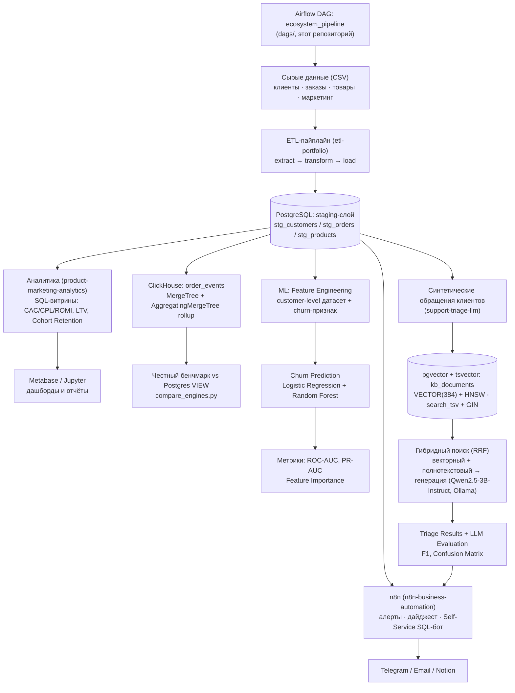
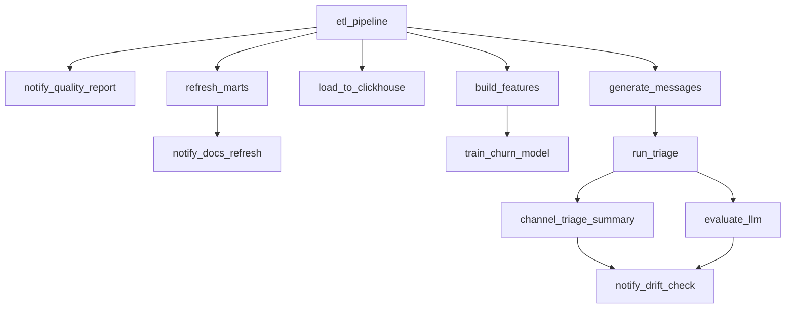

# Nikolay Kolesnikov — Data Engineering & Applied ML/LLM Portfolio Hub


## TL;DR

Спроектировал экосистему из пяти репозиториев: ETL → аналитические витрины
(плюс ClickHouse OLAP), ML-модель оттока, LLM-триаж с гибридным RAG-поиском,
A/B-тесты с power-анализом — каждый компонент решает свою бизнес-задачу
(юнит-экономика, удержание, поддержка), но опирается на общий, честно
спроектированный слой данных: индексы, тесты, CI/CD, а не демо-скрипты. Этот
репозиторий — не просто документация: Airflow-DAG оркестрирует весь пайплайн
и триггерит event-driven автоматизацию на n8n (алерты, Notion, Telegram-бот).

## 🏗 Архитектура системы



## 🛠 Технологический стек

**Data Engineering**
- PostgreSQL 17 (оконные функции, CTE, явные индексы на FK-колонках,
  MATERIALIZED VIEW + REFRESH CONCURRENTLY)
- ClickHouse (MergeTree, AggregatingMergeTree, MATERIALIZED VIEW с инкрементальным rollup)
- Python: pandas, SQLAlchemy, psycopg2, clickhouse-connect
- Паттерн ETL: extract / transform / load, идемпотентная загрузка
- pytest — юнит-тесты transform-логики и агрегаций

**ML/AI**
- scikit-learn — Logistic Regression, Random Forest, метрики (ROC-AUC, PR-AUC, classification_report)
- Ollama — локальный инференс Qwen2.5-3B-Instruct (генерация) и all-minilm (эмбеддинги), без внешних API
- pgvector — векторный тип данных и HNSW-индекс для поиска по эмбеддингам
- Гибридный поиск — векторный (pgvector) + полнотекстовый (tsvector/GIN),
  объединённые Reciprocal Rank Fusion
- pydantic — валидация структурированного вывода LLM с retry-логикой

**Orchestration**
- Apache Airflow 2.10 (LocalExecutor) — DAG на 12 задач через три репозитория
  + event-driven вызовы n8n, реальные зависимости вместо ручного "сначала
  запусти это, потом то" из README
- Изолированный venv для тасков отдельно от окружения самого Airflow (см.
  «Ключевые технические достижения» — реальный конфликт версий SQLAlchemy)

**Business Automation**
- n8n (Docker, self-hosted) — event-driven обвязка вокруг Airflow: алерты
  об ошибках/дрейфе данных в Telegram/Email, еженедельный AI-дайджест
  (Ollama-сводка поверх реальных дельт), Notion-документация витрин,
  Self-Service Analytics Bot (натуральный язык → SQL → выполнение)
- Три разграниченные read-only роли PostgreSQL под разные поверхности
  атаки (доверенный Airflow-вызов vs недоверенный ввод LLM-бота) —
  `default_transaction_read_only`, `statement_timeout`, GRANT только на
  агрегированные витрины для бота

**Infrastructure/Tools**
- Docker и Docker Compose — мультисервисные стенды (Ollama + PostgreSQL/pgvector + приложение)
- GitHub Actions — CI, прогон тестов при каждом пуше
- Jupyter (nbformat, nbconvert) — выполненные ноутбуки с реальными графиками
- Metabase — self-hosted BI-дашборд поверх витрин
- python-dotenv — конфигурация через переменные окружения, секреты вне репозитория

## 🏆 Ключевые технические достижения

- **Предотвратил утечку целевой переменной** в churn-модели: исключил
  `days_since_last_order` из признаков — иначе метрика была бы фиктивно
  завышена.
- **Перевёл RAG-поиск на production-уровень**: заменил brute-force перебор
  в Python HNSW-индексом (`pgvector`) — контекст для LLM достаётся одним
  SQL-запросом, а не сканированием в памяти.
- **Внедрил количественную валидацию LLM**: confusion matrix и F1 по
  классам вместо оценки "на глаз" — точно локализовал границы
  применимости 3B-модели.
- **Индексация с проверкой на реальном плане выполнения**: подтвердил
  `EXPLAIN ANALYZE` переход `Seq Scan` → `Bitmap Index Scan` при росте
  данных до 150 000 строк.
- **Добавил ClickHouse рядом с Postgres и честно измерил разницу**: на
  объёме этого проекта (~2000 строк) Postgres быстрее — включая
  собственную инкрементальную витрину ClickHouse — и объяснил почему
  (накладные расходы колоночного движка), а не подогнал вывод под
  ожидаемое "ClickHouse быстрее".
- **CI/CD во всех пяти репозиториях**: тесты и валидация конфигурации
  прогоняются при каждом пуше.
- **A/B-тест с честным power-анализом**: заложенная разница в конверсии
  (6% vs 11%, n=200) статистически не значима (p=0.205) — power-анализ
  показывает, что нужно ~5x больше клиентов. Саму формулу power-анализа
  дополнительно подтвердил 1000 Monte-Carlo симуляций.
- **Соединил метрики двух репозиториев в один бизнес-инсайт**: канал с
  лучшим ROMI (`referral`) независимо совпал с каналом с наибольшей
  долей негативных обращений в поддержку — сигнал, недоступный
  изолированным демо.
- **Гибридный поиск (RRF) в RAG**: объединил векторный и полнотекстовый
  поиск, поднял accuracy классификации с 0.69 до 0.71 — и проверкой
  гипотезы выяснил, что часть оставшихся ошибок не чинится лучшим
  поиском, а является собственным семантическим смещением 3B-модели.
- **Материализованные витрины**: `REFRESH CONCURRENTLY` + уникальный
  индекс, реальный выигрыш 1.6x–16x в зависимости от витрины — не одно
  универсальное число.
- **Оркестрировал через Airflow и нашёл конфликт зависимостей до
  продакшна**: DAG на 12 задач одним прогоном через все репозитории
  (Docker — Airflow официально не поддерживает Windows). Установка
  зависимостей тасков в окружение самого Airflow сломала бы его
  веб-интерфейс (конфликт версий `sqlalchemy`) — решение: отдельный venv
  для тасков. Честный прогон вскрыл: LLM-таск занял ~51 минуту вместо
  задокументированных ~24 (конкуренция за CPU/RAM с самим Airflow-стеком),
  и повторный прогон синтетических данных дал другую accuracy — оба
  честно задокументированы, а не скрыты.
- **Self-Service SQL-бот**:  три независимых слоя защиты, проверенными
  эмпирически. Узкая read-only роль без доступа к PII,
  `default_transaction_read_only`, `statement_timeout=5s`. На реальной БД
  подтвердил, что чтение PII/`INSERT`/`pg_sleep(10)` блокируются
  по-настоящему, а не только на словах в промпте.

## 📦 Компоненты экосистемы

- **[etl-portfolio](https://github.com/exist-ty/etl-portfolio)** — надёжный
  ETL-пайплайн, превращающий "грязные" сырые данные интернет-магазина в
  проиндексированный staging-слой PostgreSQL, готовый к аналитике и ML.
- **[product-marketing-analytics](https://github.com/exist-ty/product-marketing-analytics)** —
  SQL-витрины юнит-экономики (CAC/CPL/ROMI, LTV, retention) с материализованными
  версиями, модель прогнозирования оттока клиентов, ClickHouse OLAP-слой с
  честным бенчмарком против Postgres и A/B-тестирование с power-анализом
  поверх общего staging-слоя.
- **[support-triage-llm](https://github.com/exist-ty/support-triage-llm)** —
  автоматическая классификация и приоритизация обращений в поддержку локальной
  LLM с гибридным (векторный + полнотекстовый, RRF) RAG-поиском и
  количественной оценкой качества.
- **[n8n-business-automation](https://github.com/exist-ty/n8n-business-automation)** —
  event-driven автоматизация вокруг DAG: алерты об ошибках/дрейфе данных,
  еженедельный AI-дайджест, Notion-документация, Self-Service Analytics Bot
  в Telegram.
- **Этот репозиторий** — помимо документации, `docker-compose.yml` +
  `dags/ecosystem_pipeline_dag.py`: Airflow (LocalExecutor) оркестрирует
  основной пайплайн трёх репозиториев выше (etl-portfolio,
  product-marketing-analytics, support-triage-llm) одним DAG, а
  n8n-business-automation не встроен в DAG как ещё один узел — он вызывается
  из этого же DAG через webhook на ключевых точках (событие, а не шаг
  пайплайна), подробнее — «🤖 Бизнес-автоматизация (n8n)» ниже.

## 🚀 Быстрый старт

Три репозитория рассчитаны на совместное расположение в соседних директориях
(взаимные относительные ссылки на общую базу `etl_portfolio`):

```bash
git clone https://github.com/exist-ty/etl-portfolio.git
git clone https://github.com/exist-ty/product-marketing-analytics.git
git clone https://github.com/exist-ty/support-triage-llm.git
```

Для каждого репозитория — стандартный production-ready цикл:

```bash
python -m venv .venv && .venv\Scripts\activate
pip install -r requirements.txt
cp .env.example .env        # указать реальные креды, .env — вне git
pytest                       # проверить, что окружение готово
```

1. **etl-portfolio** — поднять PostgreSQL, применить `sql/schema.sql`,
   сгенерировать и загрузить данные (`python -m src.etl.pipeline`).
2. **product-marketing-analytics** — применить `sql/marts.sql`, поднять
   Metabase одной командой (`docker compose up -d`), обучить модель оттока
   (`python ml/train_churn_model.py`).
3. **support-triage-llm** — поднять `pgvector`-контейнер и Ollama
   (`docker compose up -d`), применить `sql/triage_schema.sql`, прогнать
   пайплайн триажа (`python scripts/run_triage.py`).
4. **Этот репозиторий (оркестрация)** — см. «Оркестрация (Airflow)» ниже.

Секреты нигде не хардкожены — только через `.env`, чувствительные файлы
исключены `.gitignore`; каждый сервис контейнеризирован и поднимается
одной командой Docker Compose.

## 🔄 Оркестрация (Airflow)

Три репозитория выше документируют свои зависимости в README как ручные
инструкции ("сначала прогони X, потом Y") — реальные зависимости между
задачами, просто не выраженные явно. `dags/ecosystem_pipeline_dag.py`
превращает их в настоящий DAG на 12 задач (9 задач самого пайплайна +
3 `notify_*`, которые будят соответствующие воркфлоу в
`n8n-business-automation` через webhook):



**Почему Docker, а не нативный Windows.** Apache Airflow официально не
поддерживает Windows (только Linux/macOS/WSL2). Стек — Postgres для
метаданных Airflow + `airflow-init` (миграция БД, создание пользователя) +
webserver + scheduler (`LocalExecutor` — Celery/Redis для пет-проекта
избыточны), на том же Docker Desktop, что уже используется для
Metabase/ClickHouse/pgvector. Три репозитория смонтированы в контейнер
как read-write volume'ы (`../etl-portfolio`, `../product-marketing-analytics`,
`../llm-practice` — под именем `support-triage-llm` в контейнере).

**Найденный конфликт зависимостей.** Изначально задачные зависимости
(pandas, sqlalchemy, clickhouse-connect и т.д.) ставились прямо в окружение
Airflow с `--constraint` из официального constraints-файла — это тихо
понизило `sqlalchemy` до 1.4.54, потому что сам Airflow 2.x жёстко требует
`sqlalchemy<2.0` (через `flask-appbuilder`/`marshmallow-sqlalchemy`, на
которых держится веб-интерфейс), а `etl-portfolio` использует
`from sqlalchemy import Engine` — API, которого в 1.4 нет. Первый прогон
`etl_pipeline` упал с `ImportError` прямо на этом. Решение — отдельный venv
для задач (`/home/airflow/task-venv`, см. `Dockerfile`), полностью
изолированный от Python-окружения самого Airflow; DAG вызывает
`/home/airflow/task-venv/bin/python`, а не системный `python`.

**Переменные подключения.** `.env` каждого репозитория содержит
`DB_HOST=localhost` — внутри контейнера это сам контейнер, не хост.
Переопределено на уровне `docker-compose.yml` (`DB_HOST=host.docker.internal`
и аналогично для `VECTOR_DB_HOST`/`CLICKHOUSE_HOST`/`OLLAMA_HOST`) — тот же
приём, что уже использует `product-marketing-analytics/docker-compose.yml`
для Metabase. `python-dotenv` не перезаписывает уже установленные
переменные окружения, поэтому `.env` репозиториев трогать не пришлось.

**Как запустить:**
```bash
cp .env.example .env   # свои креды тех же баз, что в трёх репозиториях
docker compose up -d
```
UI — `http://localhost:8080` (admin/admin, создаётся `airflow-init`
автоматически — локальный dev-логин, не для деплоя в открытую сеть).
Запустить DAG: кнопка в UI или
`docker compose exec airflow-scheduler airflow dags trigger ecosystem_pipeline`.

**Честный результат полного прогона.** 9/9 задач успешно, `LocalExecutor`
реально выполнил четыре независимые ветки (`refresh_marts`,
`load_to_clickhouse`, `build_features`, `generate_messages`) параллельно
после `etl_pipeline`. Это измерение — с версии DAG на 9 задач, до
добавления трёх `notify_*`. Каждая из них по отдельности проверена внутри
контейнера через `airflow tasks test ecosystem_pipeline notify_* ...`
(не curl с хоста — именно то, что реально выполнит `BashOperator`):
`curl` уходил из контейнера, n8n отвечал `{"message":"Workflow was
started"}`, задача помечалась `SUCCESS`. Честная оговорка: это три
изолированных прогона одной задачи, а не один свежий сквозной прогон
всех 12 задач подряд — таймингов вроде "51 минута" для новой,
12-задачной версии DAG пока нет. Два дополнительных честных наблюдения
из того самого прогона на 9 задач:

- **`run_triage` занял ~51 минуту** вместо задокументированных в
  `support-triage-llm` ~24 — правдоподобное объяснение: Airflow (Postgres +
  webserver + scheduler) и CPU-инференс Ollama делят одни и те же
  ограниченные CPU/RAM этой машины (8GB RAM — уже известное ограничение,
  не гипотеза задним числом). Не измерялось строго изолированно, но
  направление объяснимо и согласуется с уже задокументированным риском.
- **Повторный прогон синтетических данных дал другие числа**: accuracy 0.73
  (против 0.69 на dense-поиске и 0.71 на гибридном в предыдущих прогонах),
  и канал с наибольшей долей жалоб сменился (`referral` 25% в одном прогоне,
  12.5% в этом, `context_ads` — 20%). Это не противоречие между прогонами, а
  живая иллюстрация уже честно задокументированной оговорки "n=45 не
  статистически значимо" — теперь с фактическим повторным измерением, а не
  только предупреждением в тексте.

## 🤖 Бизнес-автоматизация (n8n)

Отдельный репозиторий [`n8n-business-automation`](https://github.com/exist-ty/n8n-business-automation)
— event-driven обвязка вокруг DAG выше: то, что происходит **вокруг**
пайплайна и обращено к людям, а не к данным. Airflow и n8n не дублируют
друг друга — каждый n8n-воркфлоу вызывается webhook'ом ИЗ DAG, а не
пересчитывает то, что DAG уже посчитал.

Шесть воркфлоу: ETL Failure Alert, AI Data Quality Report, Data Drift
Monitor, Weekly AI Business Digest (AI-сводка через тот же локальный
Ollama), Notion Auto Documentation, Self-Service Analytics Bot
(натуральный язык → SQL → выполнение в Telegram).

**Честно проверено вживую**: 5 из 6 воркфлоу реально отработали до
конца (статус `success` в БД n8n, не предположение) — включая Notion
Auto Documentation, который реально обновил живую страницу в Notion
(проверено независимо, через прямой запрос к странице: старое
содержимое заменилось именно тем, что генерирует воркфлоу). По пути
нашёл и починил реальный баг доступа — у read-only роли не было
`SELECT` на новую таблицу-каталог описаний. Self-Service Analytics Bot
протестирован через настоящий Telegram (не только через curl) —
реальные вопросы менеджера через реальные вызовы `qwen2.5:3b-instruct`:
часть дала корректный результат, один вопрос про "последний месяц" дал
синтаксически верный, безопасный, но пустой результат (данные статичны,
модель об этом не знает), другой вопрос модель в одной попытке решила,
а в другой — ошибочно отклонила (нестабильность маленькой модели между
запусками). Три независимых слоя защиты бота (ограниченная роль БД,
`default_transaction_read_only`, `statement_timeout`) проверены
конкретными атаками (чтение PII, `INSERT`, `pg_sleep`) — все три
заблокированы на уровне PostgreSQL, не только на уровне промпта.

Полное описание, честные результаты тестирования и обоснование модели
угроз — в README и `docs/` самого репозитория.
