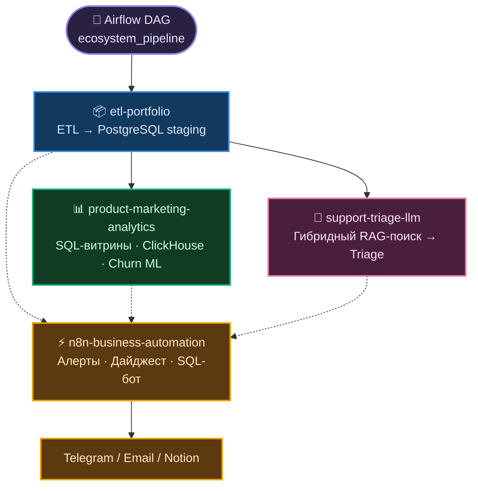
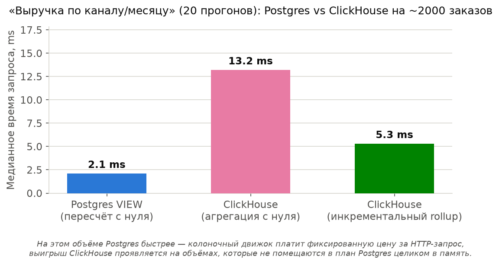
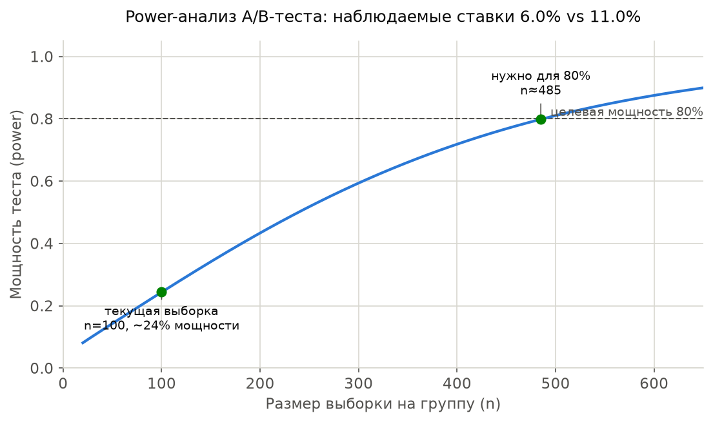
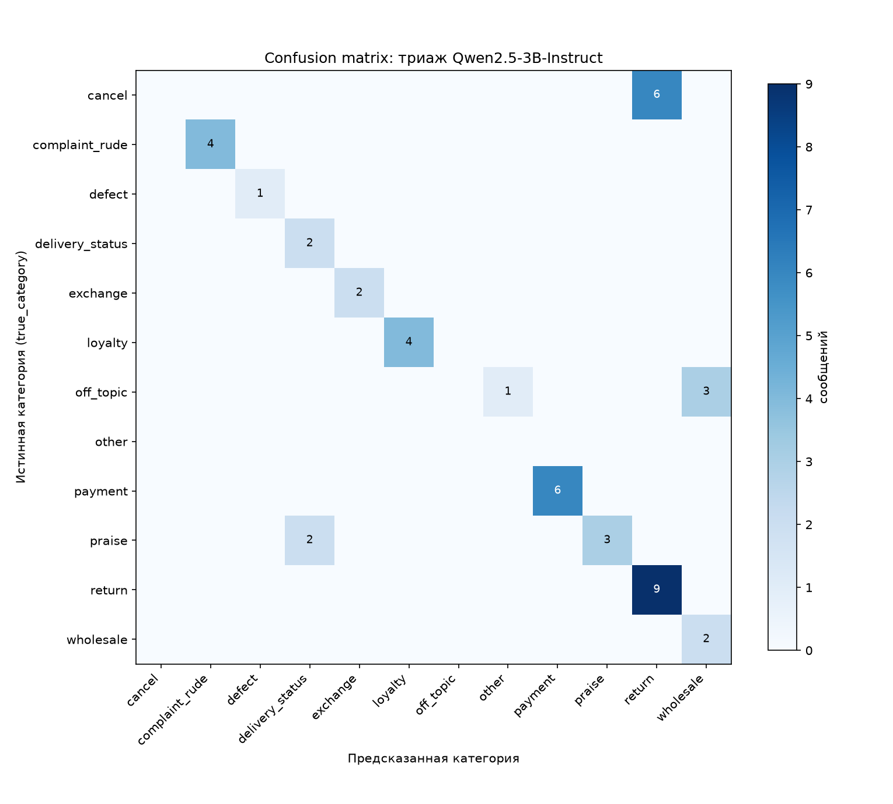
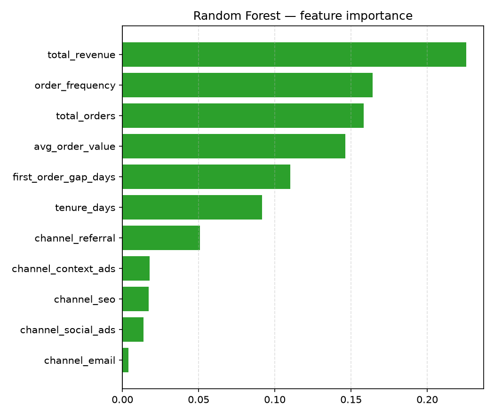

# Nikolay Kolesnikov — Data Engineering & Applied ML/LLM Portfolio Hub

## TL;DR

Спроектировал экосистему из пяти репозиториев: ETL → аналитические витрины
(плюс ClickHouse OLAP), ML-модель оттока, LLM-триаж с гибридным RAG-поиском,
A/B-тесты с power-анализом — каждый компонент решает свою бизнес-задачу
(юнит-экономика, удержание, поддержка), но опирается на общий, честно
спроектированный слой данных: индексы, тесты, CI/CD, а не демо-скрипты. Этот
репозиторий — не просто документация: Airflow-DAG оркестрирует весь пайплайн
и триггерит event-driven автоматизацию на n8n (алерты, Notion, Telegram-бот).

## 🏗 Архитектура системы

Сплошные стрелки — пайплайн-поток данных, пунктирные — "читается
напрямую" (n8n не встроен в DAG как ещё один шаг, а читает staging и
витрины по событию, см. ниже). n8n читает не только staging
(`etl-portfolio` — Data Quality Report, Notion-документация), но и
витрины `product-marketing-analytics` напрямую (Self-Service SQL-бот —
`GRANT SELECT` выдан именно на `mart_channel_economics`/`mart_customer_ltv`/
`mart_cohort_retention`, см. `sql/readonly_role_selfservice.sql` в
`n8n-business-automation`). Подробный разбор каждого узла —
[`docs/architecture.md`](docs/architecture.md).

## 🛠 Технологический стек

| Категория | Технологии |
|---|---|
| **Data Engineering** | PostgreSQL 17 (оконные функции, CTE, индексы на FK, `MATERIALIZED VIEW` + `REFRESH CONCURRENTLY`), ClickHouse (`MergeTree`, `AggregatingMergeTree`), pandas, SQLAlchemy, psycopg2, clickhouse-connect, pytest |
| **ML/AI** | scikit-learn (Logistic Regression, Random Forest), Ollama (Qwen2.5-3B-Instruct + all-minilm, локальный инференс), pgvector + HNSW, гибридный поиск (RRF), pydantic, MLflow (трекинг экспериментов) |
| **Orchestration** | Apache Airflow 2.10 (`LocalExecutor`), DAG на 16 задач через три репозитория + event-driven вызовы n8n; изолированный venv для тасков (см. [ADR 005](docs/adr/005-why-separate-venv-for-tasks.md)) |
| **Business Automation** | n8n (self-hosted, event-driven): алерты, AI-дайджест, Notion-документация, Self-Service SQL-бот; три разграниченные read-only роли PostgreSQL под разные поверхности атаки |
| **Infrastructure** | Docker / Docker Compose, GitHub Actions CI, Jupyter (nbformat/nbconvert), Metabase, python-dotenv |

## 📊 Визуализации

<table>
<tr>
<td></td>
<td></td>
</tr>
<tr>
<td></td>
<td></td>
</tr>
</table>

## 🏆 Ключевые технические достижения

- **A/B-тест с честным power-анализом**: заложенная разница в конверсии
  (6% vs 11%, n=200) статистически не значима (p=0.205) — power-анализ
  показывает, что нужно ~5x больше клиентов, а не спрятанное за одной
  цифрой заключение. Саму формулу power-анализа дополнительно подтвердил
  1000 Monte-Carlo симуляций — не подгонка результата под красивый p.
- **Гибридный RAG (RRF) с количественной, а не приблизительной оценкой**:
  объединил векторный и полнотекстовый поиск, поднял accuracy классификации
  с 0.69 до 0.71 — и confusion-matrix анализом выяснил, что часть оставшихся
  ошибок не чинится лучшим поиском, а является собственным семантическим
  смещением 3B-модели.
- **Добавил ClickHouse рядом с Postgres и честно измерил разницу**: на
  объёме этого проекта (~2000 строк) Postgres быстрее — включая
  собственную инкрементальную витрину ClickHouse — и объяснил, почему
  (накладные расходы колоночного движка), а не подогнал вывод под
  ожидаемое "ClickHouse быстрее" (детали — [ADR 004](docs/adr/004-why-clickhouse-alongside-postgres.md)).
- **Оркестрировал через Airflow и нашёл конфликт зависимостей до
  продакшна**: DAG на 16 задач одним прогоном через все репозитории.
  Установка зависимостей тасков в окружение самого Airflow сломала бы его
  веб-интерфейс (конфликт версий SQLAlchemy) — решение задокументировано в
  [ADR 005](docs/adr/005-why-separate-venv-for-tasks.md). Живая проверка
  новых задач (`system_health_check`, `check_drift`) поймала ещё один
  реальный баг (`numpy.bool_` не сериализуется в JSON) и одну реальную
  проблему инфраструктуры (упавший ClickHouse-контейнер) — подробности в
  [`docs/orchestration.md`](docs/orchestration.md).

## 📦 Компоненты экосистемы

- [`etl-portfolio`](https://github.com/exist-ty/etl-portfolio) — ETL:
  "грязные" сырые данные → проиндексированный staging-слой PostgreSQL.
- [`product-marketing-analytics`](https://github.com/exist-ty/product-marketing-analytics) —
  SQL-витрины юнит-экономики, ClickHouse OLAP, churn-модель, A/B-тесты.
- [`support-triage-llm`](https://github.com/exist-ty/support-triage-llm) —
  триаж обращений локальной LLM с гибридным RAG-поиском.
- [`n8n-business-automation`](https://github.com/exist-ty/n8n-business-automation) —
  event-driven автоматизация: алерты, дайджест, Self-Service SQL-бот.
- **Этот репозиторий** — Airflow DAG, оркестрирующий три репозитория выше.

Полный разбор каждого — [`docs/architecture.md`](docs/architecture.md).

## 📚 Документация

- [`docs/quickstart.md`](docs/quickstart.md) — быстрый старт всех репозиториев.
- [`docs/architecture.md`](docs/architecture.md) — архитектура и компоненты подробно.
- [`docs/orchestration.md`](docs/orchestration.md) — Airflow DAG, найденные конфликты, честные результаты прогонов.
- [`docs/business-automation.md`](docs/business-automation.md) — n8n-автоматизация.
- [`docs/adr/`](docs/adr/) — Architecture Decision Records: почему Airflow, почему Ollama, почему RRF, почему ClickHouse рядом с Postgres, почему отдельный venv для тасков.
- [`docs/case_studies/`](docs/case_studies/) — три реальных инцидента (Problem → Investigation → Solution → Lesson Learned): конфликт версий SQLAlchemy, ClickHouse медленнее ожидаемого, non-determinism LLM-триажа.
- [`docs/roadmap.md`](docs/roadmap.md) — что дальше при реальном росте (Spark, Kafka, Kubernetes, vLLM/TGI, S3+Iceberg, Grafana) и почему не нужно сейчас.
