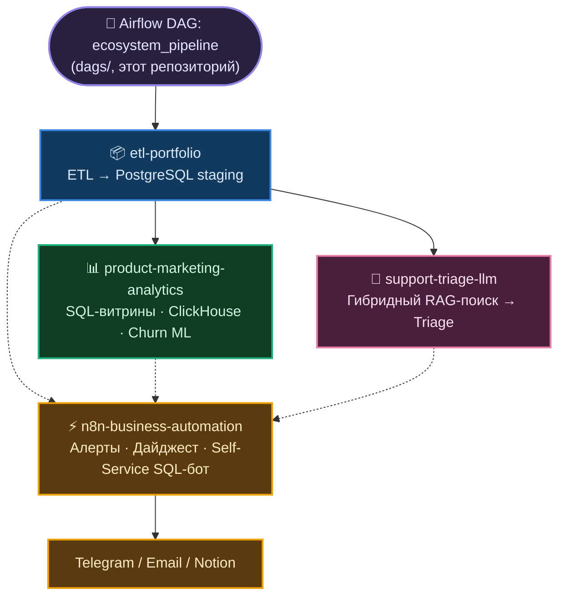

# Архитектура системы

Сплошные стрелки — пайплайн-поток данных (Airflow DAG вызывает эти
репозитории по очереди), пунктирные — "читается напрямую": n8n не встроен
в DAG как ещё один шаг, а читает staging `etl-portfolio` (Data Quality
Report, Notion-документация) и витрины `product-marketing-analytics`
напрямую (`mart_channel_economics`/`mart_customer_ltv`/`mart_cohort_retention` —
`GRANT SELECT` выдан именно на них для Self-Service SQL-бота, см.
`sql/readonly_role_selfservice.sql` в `n8n-business-automation`) по
событию, а не как шаг пайплайна.

## Компоненты экосистемы

- **[etl-portfolio](https://github.com/exist-ty/etl-portfolio)** — надёжный
  ETL-пайплайн, превращающий "грязные" сырые данные интернет-магазина в
  проиндексированный staging-слой PostgreSQL, готовый к аналитике и ML.
  Отдельно от основного DAG (`run()`, полная перезаливка) — watermark-инкремент
  по `order_date` с upsert и реальный backfill за весь 2025 год (365 дней,
  1985 заказов через `ON CONFLICT DO UPDATE`, идемпотентность проверена
  тестом, не обещанием); в сам DAG пока не переключено, см.
  [`docs/roadmap.md`](roadmap.md).
- **[product-marketing-analytics](https://github.com/exist-ty/product-marketing-analytics)** —
  SQL-витрины юнит-экономики (CAC/CPL/ROMI, LTV, retention) с материализованными
  версиями, модель прогнозирования оттока клиентов, ClickHouse OLAP-слой с
  честным бенчмарком против Postgres и A/B-тестирование с power-анализом
  поверх общего staging-слоя. Поверх витрин — три аналитических слоя:
  - `metrics/` — реестр метрик как единственный источник истины. Определения
    LTV/CAC/ROMI/retention были размазаны по витринам, ноутбуку, SQL внутри
    n8n и карточкам Metabase; здесь они описаны один раз, а SQL каждого
    потребителя порождается из описания. `metrics/README.md` разбирает девять
    найденных расхождений между этими копиями.
  - `analysis/` — RFM-сегментация с границами по естественным разрывам,
    survival-анализ оттока (Kaplan-Meier, log-rank, Cox PH) с корректной
    обработкой правого цензурирования и когортная юнит-экономика с расчётом
    окупаемости.
  - `ab_test/` — экспериментальная платформа поверх исходного A/B-теста:
    always-valid p-values (mSPRT) для подглядывания без инфляции ошибки
    первого рода, CUPED для снижения дисперсии, проверка SRM, guardrail-метрики
    и правило остановки. Реестр экспериментов — `sql/experiments_schema.sql`.
- **[support-triage-llm](https://github.com/exist-ty/support-triage-llm)** —
  автоматическая классификация и приоритизация обращений в поддержку локальной
  LLM с гибридным (векторный + полнотекстовый, RRF) RAG-поиском и
  количественной оценкой качества. Отдельно, опционально — честное сравнение
  с облачной Llama 3.3 70B Instruct (Groq API) на том же пайплайне и промпте:
  accuracy 0.733 → 0.911, задержка ~24.6с → ~2.0с (n=45, `compare_models.py`).
- **[n8n-business-automation](https://github.com/exist-ty/n8n-business-automation)** —
  event-driven автоматизация вокруг DAG: алерты об ошибках/дрейфе данных,
  еженедельный AI-дайджест, Notion-документация, Self-Service Analytics Bot
  в Telegram. AI-дайджест переключаем между локальной Qwen (по умолчанию) и
  облачной Llama 3.3 70B (`DIGEST_LLM_BACKEND=groq`) — HTTP-вызов и
  Bearer-аутентификация проверены вживую из контейнера n8n.
- **Этот репозиторий** — помимо документации, `docker-compose.yml` +
  `dags/ecosystem_pipeline_dag.py`: Airflow (LocalExecutor) оркестрирует
  основной пайплайн трёх репозиториев выше (etl-portfolio,
  product-marketing-analytics, support-triage-llm) одним DAG, а
  n8n-business-automation не встроен в DAG как ещё один узел — он вызывается
  из этого же DAG через webhook на ключевых точках (событие, а не шаг
  пайплайна), подробнее — `docs/business-automation.md`.

См. также `docs/orchestration.md` (как DAG вызывает эти репозитории) и
`docs/adr/` (архитектурные решения с обоснованием и последствиями).
