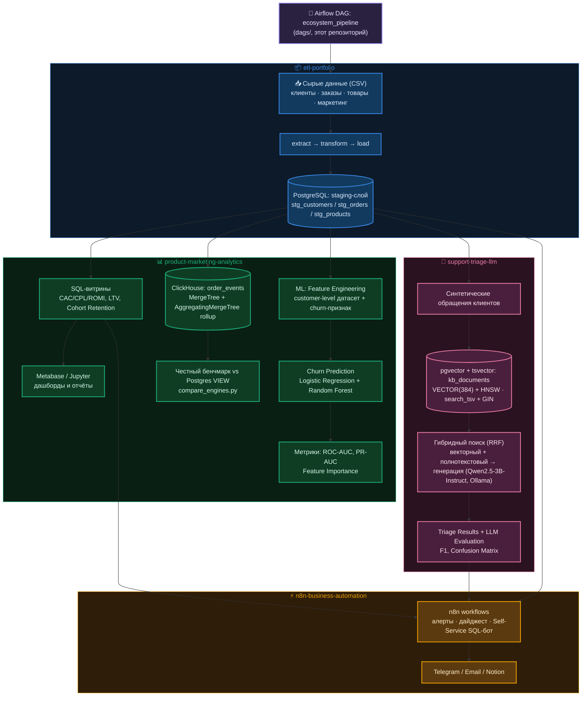

# Архитектура системы

Каждая рамка — отдельный репозиторий; `PostgreSQL staging` в
`etl-portfolio` — общая точка входа, из которой читают все остальные три. n8n
дополнительно читает витрины `product-marketing-analytics` напрямую
(`mart_channel_economics`/`mart_customer_ltv`/`mart_cohort_retention` —
`GRANT SELECT` выдан именно на них для Self-Service SQL-бота, см.
`sql/readonly_role_selfservice.sql` в `n8n-business-automation`), не только
staging-слой `etl-portfolio`.

## Компоненты экосистемы

- **[etl-portfolio](https://github.com/exist-ty/etl-portfolio)** — надёжный
  ETL-пайплайн, превращающий "грязные" сырые данные интернет-магазина в
  проиндексированный staging-слой PostgreSQL, готовый к аналитике и ML.
- **[product-marketing-analytics](https://github.com/exist-ty/product-marketing-analytics)** —
  SQL-витрины юнит-экономики (CAC/CPL/ROMI, LTV, retention) с материализованными
  версиями, модель прогнозирования оттока клиентов, ClickHouse OLAP-слой с
  честным бенчмарком против Postgres и A/B-тестирование с power-анализом
  поверх общего staging-слоя.
- **[support-triage-llm](https://github.com/exist-ty/support-triage-llm)** —
  автоматическая классификация и приоритизация обращений в поддержку локальной
  LLM с гибридным (векторный + полнотекстовый, RRF) RAG-поиском и
  количественной оценкой качества.
- **[n8n-business-automation](https://github.com/exist-ty/n8n-business-automation)** —
  event-driven автоматизация вокруг DAG: алерты об ошибках/дрейфе данных,
  еженедельный AI-дайджест, Notion-документация, Self-Service Analytics Bot
  в Telegram.
- **Этот репозиторий** — помимо документации, `docker-compose.yml` +
  `dags/ecosystem_pipeline_dag.py`: Airflow (LocalExecutor) оркестрирует
  основной пайплайн трёх репозиториев выше (etl-portfolio,
  product-marketing-analytics, support-triage-llm) одним DAG, а
  n8n-business-automation не встроен в DAG как ещё один узел — он вызывается
  из этого же DAG через webhook на ключевых точках (событие, а не шаг
  пайплайна), подробнее — `docs/business-automation.md`.

См. также `docs/orchestration.md` (как DAG вызывает эти репозитории) и
`docs/adr/` (архитектурные решения с обоснованием и последствиями).
