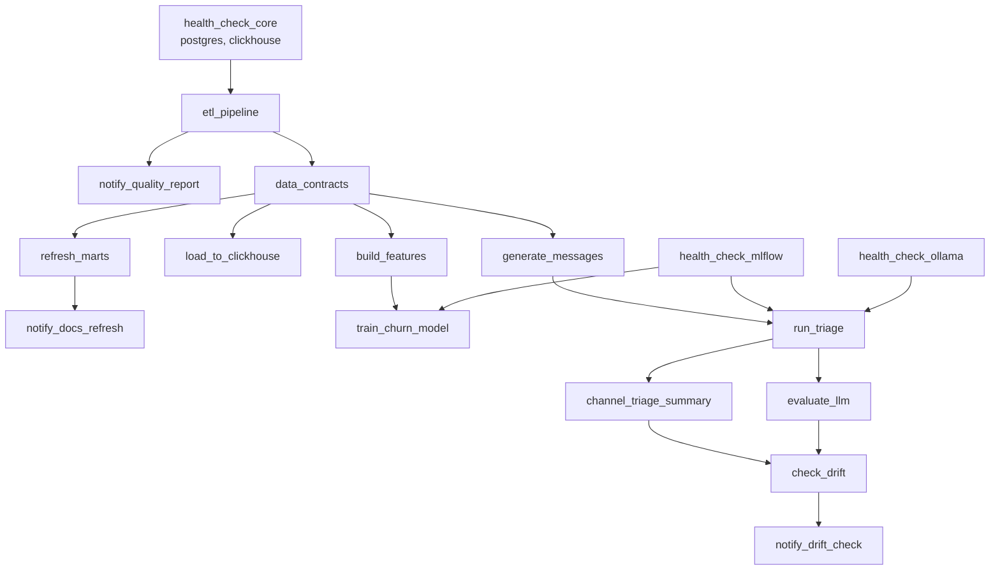

# Оркестрация (Airflow)

Три репозитория экосистемы ([`etl-portfolio`](https://github.com/exist-ty/etl-portfolio),
[`product-marketing-analytics`](https://github.com/exist-ty/product-marketing-analytics),
[`support-triage-llm`](https://github.com/exist-ty/support-triage-llm)) документируют свои зависимости в README как ручные
инструкции ("сначала прогони X, потом Y") — реальные зависимости между
задачами, просто не выраженные явно. `dags/ecosystem_pipeline_dag.py`
превращает их в настоящий DAG на 17 задач: 10 задач самого пайплайна,
3 `notify_*` (будят воркфлоу в [`n8n-business-automation`](https://github.com/exist-ty/n8n-business-automation) через webhook),
3 `health_check_*` (`scripts/health_check.py`) и `check_drift` (дрейф
`total_amount` неделя к неделе, `scripts/check_drift.py` — результат
передаётся `notify_drift_check` как тело POST-запроса). `data_contracts`
(Soda Core, [`etl-portfolio/soda/checks.yml`](https://github.com/exist-ty/etl-portfolio/blob/master/soda/checks.yml)) гейтит витрины fail-fast ДО их
построения — в отличие от `notify_quality_report`, который срабатывает
параллельно и постфактум, см. [roadmap.md](roadmap.md):



**Почему три health-проверки, а не одна.** Сначала здесь был единственный
`system_health_check`, проверявший все четыре сервиса сразу и стоявший
корнем всего графа. Это связывало несвязанное: неподнятый Ollama блокировал
в том числе `refresh_marts` и `load_to_clickhouse`, которым Ollama не нужен
вообще. Теперь каждая ветка гейтится ровно своими сервисами. Заодно исчезли
два `mlflow_healthcheck_*`, стоявшие ПОСЛЕ `train_churn_model` и
`evaluate_llm`: проверять доступность трекинга осмысленно до обучения, а не
после — падать на недоступном MLflow через 24 минуты инференса дорого.

**Почему WARNING не роняет задачу.** `health_check.py` возвращает 1 только
на `ERROR` (сервис недоступен). `WARNING` — пустая таблица или несвежие
данные — печатается в лог, но пайплайн не блокирует. Раньше WARNING тоже
возвращал 1, и поскольку health check стоит корнем ветки, любой варнинг
останавливал весь граф. С замороженным датасетом (`order_date` не позже
2025-12-31, см. `etl-portfolio/scripts/generate_data.py`) при
`STALE_DAYS=400` это гарантированно положило бы весь пайплайн в начале
февраля 2027 — отложенный отказ, который не проявился бы до самого дня.

**Почему Docker, а не нативный Windows.** Apache Airflow официально не
поддерживает Windows (только Linux/macOS/WSL2). Стек — Postgres для
метаданных Airflow + `airflow-init` (миграция БД, создание пользователя) +
webserver + scheduler (`LocalExecutor` — Celery/Redis для пет-проекта
избыточны, см. [`docs/adr/001-why-airflow-not-prefect.md`](adr/001-why-airflow-not-prefect.md)), на том же Docker
Desktop, что уже используется для Metabase/ClickHouse/pgvector. Три
репозитория смонтированы в контейнер как read-write volume'ы
(`../etl-portfolio`, `../product-marketing-analytics`, `../llm-practice` —
под именем `support-triage-llm` в контейнере).

**Найденный конфликт зависимостей.** Изначально задачные зависимости
(pandas, sqlalchemy, clickhouse-connect и т.д.) ставились прямо в окружение
Airflow с `--constraint` из официального constraints-файла — это тихо
понизило `sqlalchemy` до 1.4.54, потому что сам Airflow 2.x жёстко требует
`sqlalchemy<2.0` (через `flask-appbuilder`/`marshmallow-sqlalchemy`, на
которых держится веб-интерфейс), а `etl-portfolio` использует
`from sqlalchemy import Engine` — API, которого в 1.4 нет. Первый прогон
`etl_pipeline` упал с `ImportError` прямо на этом. Решение — отдельный venv
для задач (`/home/airflow/task-venv`, см. `Dockerfile` и
[`docs/adr/005-why-separate-venv-for-tasks.md`](adr/005-why-separate-venv-for-tasks.md)), полностью изолированный от
Python-окружения самого Airflow; DAG вызывает
`/home/airflow/task-venv/bin/python`, а не системный `python`.

**Переменные подключения.** `.env` каждого репозитория содержит
`DB_HOST=localhost` — внутри контейнера это сам контейнер, не хост.
Переопределено на уровне `docker-compose.yml` (`DB_HOST=host.docker.internal`
и аналогично для `VECTOR_DB_HOST`/`CLICKHOUSE_HOST`/`OLLAMA_HOST`) — тот же
приём, что уже использует `product-marketing-analytics/docker-compose.yml`
для Metabase. `python-dotenv` не перезаписывает уже установленные
переменные окружения, поэтому `.env` репозиториев трогать не пришлось.

**Как запустить:**
```bash
cp .env.example .env   # свои креды тех же баз, что в трёх репозиториях
docker compose up -d
```
UI — `http://localhost:8080` (admin/admin, создаётся `airflow-init`
автоматически — локальный dev-логин, не для деплоя в открытую сеть).
Запустить DAG: кнопка в UI или
`docker compose exec airflow-scheduler airflow dags trigger ecosystem_pipeline`.

**Честный результат полного прогона.** 9/9 задач успешно, `LocalExecutor`
реально выполнил четыре независимые ветки (`refresh_marts`,
`load_to_clickhouse`, `build_features`, `generate_messages`) параллельно
после `etl_pipeline`. Это измерение — с версии DAG на 9 задач, до
добавления трёх `notify_*`. Каждая из них по отдельности проверена внутри
контейнера через `airflow tasks test ecosystem_pipeline notify_* ...`
(не curl с хоста — именно то, что реально выполнит `BashOperator`):
`curl` уходил из контейнера, n8n отвечал `{"message":"Workflow was
started"}`, задача помечалась `SUCCESS`. Честная оговорка: это три
изолированных прогона одной задачи, а не один свежий сквозной прогон
всех 16 задач подряд — таймингов вроде "51 минута" для новой,
16-задачной версии DAG пока нет. Два дополнительных честных наблюдения
из того самого прогона на 9 задач:

- **`run_triage` занял ~51 минуту** вместо задокументированных в
  `support-triage-llm` ~24 — правдоподобное объяснение: Airflow (Postgres +
  webserver + scheduler) и CPU-инференс Ollama делят одни и те же
  ограниченные CPU/RAM этой машины (8GB RAM — уже известное ограничение,
  не гипотеза задним числом). Не измерялось строго изолированно, но
  направление объяснимо и согласуется с уже задокументированным риском.
- **Повторный прогон синтетических данных дал другие числа**: accuracy 0.73
  (против 0.69 на dense-поиске и 0.71 на гибридном в предыдущих прогонах),
  и канал с наибольшей долей жалоб сменился (`referral` 25% в одном прогоне,
  12.5% в этом, `context_ads` — 20%). Это не противоречие между прогонами, а
  живая иллюстрация уже честно задокументированной оговорки "n=45 не
  статистически значимо" — теперь с фактическим повторным измерением, а не
  только предупреждением в тексте.

**Проверка 4 новых задач** (тогда — `system_health_check`, `check_drift`,
`mlflow_healthcheck_churn`, `mlflow_healthcheck_triage`; первая и две
последние с тех пор заменены на три `health_check_*`, см. выше). Тем же
способом — `airflow tasks test` внутри контейнера, не изолированный запуск
скрипта руками. Нашли и починили один реальный баг и одну реальную (не
тестовую) проблему инфраструктуры:

- **`check_drift` падал с `TypeError: Object of type bool is not JSON
  serializable`** — `drift_detected` был `numpy.bool_` (результат сравнения
  `numpy.float64`), а не встроенный `bool`; в отличие от `numpy.float64`
  (де-факто подкласс `float`, `json.dumps` его принимает), `numpy.bool_`
  роняет сериализацию. Починено явным `bool(...)` — и с тех пор закрыто
  тестом (`tests/test_check_drift.py::test_result_is_json_serializable`):
  баг нашёлся руками в прогоне, но повторно проходить мимо CI он не должен.
- **health check реально поймал ClickHouse в состоянии `Exited`**
  (контейнер лежал ещё с предыдущей перезагрузки Docker Desktop) —
  `status: "ERROR"` с точным сообщением о недоступности `host.docker.internal:8123`,
  задача честно упала с ненулевым кодом. После `docker start` — `OK`.

## OpenLineage и Marquez

**Зачем.** У пяти репозиториев не было единого способа ответить "откуда
взялось это число в дайджесте", кроме чтения кода трёх скриптов подряд.

**Версия провайдера.** `apache-airflow-providers-openlineage==1.14.0` — точно
та версия, что объявлена в официальном constraints-файле Airflow 2.10.4
(`constraints-2.10.4/constraints-3.11.txt`); открытый вопрос из roadmap о
совместимости закрыт этим фактом, а не догадкой — сборка `docker build`
показала, что провайдер уже входит в базовый образ `apache/airflow:2.10.4`
(`Requirement already satisfied`), пин в Dockerfile существует для
воспроизводимости и явной документации версии, а не потому что чего-то не
хватало.

**Marquez.** Сервис `marquez-api` + `marquez-db` + `marquez-web` в этом же
`docker-compose.yml`, версии и порты — из официального
`docker-compose.yml`/`.env.example` проекта Marquez. Один настоящий пробел
в их официальном файле: volume `db-init` монтируется пустым, а
`docker/init-db.sh` (создаёт роль/базу `marquez`) в репозитории лежит
отдельно и никуда не подключён — без него `marquez-api` падает при старте
(`FATAL: password authentication failed for user "marquez"`, конфиг образа
`marquez.dev.yml` жёстко использует `user: marquez`/`password: marquez`,
игнорируя переменные окружения). Скопирован в `marquez/init-db.sh` этого
репозитория и смонтирован в `/docker-entrypoint-initdb.d/`.

**Честная граница: не column-level, а table-level.** У `BashOperator` (все
задачи DAG — он) нет автоматического SQL-экстрактора, в отличие от
`PostgresOperator`/`SQLExecuteQueryOperator` — OpenLineage не может сам
понять, какие таблицы читает и пишет произвольный python-скрипт внутри
`bash_command`. Датасеты объявлены явно через `inlets`/`outlets`
(`airflow.lineage.entities.Table`) на `etl_pipeline`, `data_contracts`,
`refresh_marts`, `load_to_clickhouse` — то есть lineage-граф настоящий, но
размечен вручную на уровне таблиц, а не выведен автоматически на уровне
колонок, как несколько оптимистично формулировал roadmap до реализации.

**Проверено через API Marquez, не только по факту, что контейнер поднялся:**
`GET /api/v1/lineage?nodeId=dataset:postgres://host.docker.internal:5432:etl_portfolio.stg_orders`
реально возвращает граф, связывающий `stg_orders` → `load_to_clickhouse` →
`analytics.order_events`/`analytics.channel_monthly_revenue` в ClickHouse —
провенанс тянется через границу двух разных систем хранения, не только
внутри Postgres.

См. также [`docs/adr/`](adr/) — архитектурные решения за конкретными выборами
(Airflow, отдельный venv) с контекстом и последствиями.
