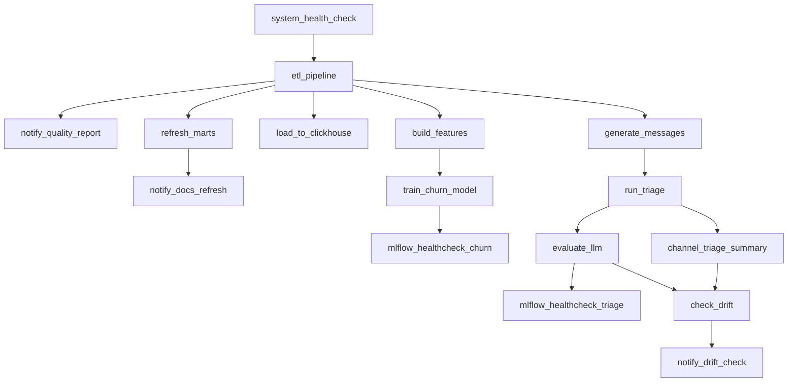

# Оркестрация (Airflow)

Три репозитория экосистемы (`etl-portfolio`, `product-marketing-analytics`,
`support-triage-llm`) документируют свои зависимости в README как ручные
инструкции ("сначала прогони X, потом Y") — реальные зависимости между
задачами, просто не выраженные явно. `dags/ecosystem_pipeline_dag.py`
превращает их в настоящий DAG на 16 задач: 9 задач самого пайплайна,
3 `notify_*` (будят воркфлоу в `n8n-business-automation` через webhook),
`system_health_check` (Postgres/ClickHouse/Ollama/MLflow до старта пайплайна,
`scripts/health_check.py`), `check_drift` (дрейф `total_amount` неделя к
неделе, `scripts/check_drift.py` — результат передаётся `notify_drift_check`
как тело POST-запроса) и два `mlflow_healthcheck_*` после обучения модели и
триажа:



**Почему Docker, а не нативный Windows.** Apache Airflow официально не
поддерживает Windows (только Linux/macOS/WSL2). Стек — Postgres для
метаданных Airflow + `airflow-init` (миграция БД, создание пользователя) +
webserver + scheduler (`LocalExecutor` — Celery/Redis для пет-проекта
избыточны, см. `docs/adr/001-why-airflow-not-prefect.md`), на том же Docker
Desktop, что уже используется для Metabase/ClickHouse/pgvector. Три
репозитория смонтированы в контейнер как read-write volume'ы
(`../etl-portfolio`, `../product-marketing-analytics`, `../llm-practice` —
под именем `support-triage-llm` в контейнере).

**Найденный конфликт зависимостей.** Изначально задачные зависимости
(pandas, sqlalchemy, clickhouse-connect и т.д.) ставились прямо в окружение
Airflow с `--constraint` из официального constraints-файла — это тихо
понизило `sqlalchemy` до 1.4.54, потому что сам Airflow 2.x жёстко требует
`sqlalchemy<2.0` (через `flask-appbuilder`/`marshmallow-sqlalchemy`, на
которых держится веб-интерфейс), а `etl-portfolio` использует
`from sqlalchemy import Engine` — API, которого в 1.4 нет. Первый прогон
`etl_pipeline` упал с `ImportError` прямо на этом. Решение — отдельный venv
для задач (`/home/airflow/task-venv`, см. `Dockerfile` и
`docs/adr/005-why-separate-venv-for-tasks.md`), полностью изолированный от
Python-окружения самого Airflow; DAG вызывает
`/home/airflow/task-venv/bin/python`, а не системный `python`.

**Переменные подключения.** `.env` каждого репозитория содержит
`DB_HOST=localhost` — внутри контейнера это сам контейнер, не хост.
Переопределено на уровне `docker-compose.yml` (`DB_HOST=host.docker.internal`
и аналогично для `VECTOR_DB_HOST`/`CLICKHOUSE_HOST`/`OLLAMA_HOST`) — тот же
приём, что уже использует `product-marketing-analytics/docker-compose.yml`
для Metabase. `python-dotenv` не перезаписывает уже установленные
переменные окружения, поэтому `.env` репозиториев трогать не пришлось.

**Как запустить:**
```bash
cp .env.example .env   # свои креды тех же баз, что в трёх репозиториях
docker compose up -d
```
UI — `http://localhost:8080` (admin/admin, создаётся `airflow-init`
автоматически — локальный dev-логин, не для деплоя в открытую сеть).
Запустить DAG: кнопка в UI или
`docker compose exec airflow-scheduler airflow dags trigger ecosystem_pipeline`.

**Честный результат полного прогона.** 9/9 задач успешно, `LocalExecutor`
реально выполнил четыре независимые ветки (`refresh_marts`,
`load_to_clickhouse`, `build_features`, `generate_messages`) параллельно
после `etl_pipeline`. Это измерение — с версии DAG на 9 задач, до
добавления трёх `notify_*`. Каждая из них по отдельности проверена внутри
контейнера через `airflow tasks test ecosystem_pipeline notify_* ...`
(не curl с хоста — именно то, что реально выполнит `BashOperator`):
`curl` уходил из контейнера, n8n отвечал `{"message":"Workflow was
started"}`, задача помечалась `SUCCESS`. Честная оговорка: это три
изолированных прогона одной задачи, а не один свежий сквозной прогон
всех 16 задач подряд — таймингов вроде "51 минута" для новой,
16-задачной версии DAG пока нет. Два дополнительных честных наблюдения
из того самого прогона на 9 задач:

- **`run_triage` занял ~51 минуту** вместо задокументированных в
  `support-triage-llm` ~24 — правдоподобное объяснение: Airflow (Postgres +
  webserver + scheduler) и CPU-инференс Ollama делят одни и те же
  ограниченные CPU/RAM этой машины (8GB RAM — уже известное ограничение,
  не гипотеза задним числом). Не измерялось строго изолированно, но
  направление объяснимо и согласуется с уже задокументированным риском.
- **Повторный прогон синтетических данных дал другие числа**: accuracy 0.73
  (против 0.69 на dense-поиске и 0.71 на гибридном в предыдущих прогонах),
  и канал с наибольшей долей жалоб сменился (`referral` 25% в одном прогоне,
  12.5% в этом, `context_ads` — 20%). Это не противоречие между прогонами, а
  живая иллюстрация уже честно задокументированной оговорки "n=45 не
  статистически значимо" — теперь с фактическим повторным измерением, а не
  только предупреждением в тексте.

**Проверка 4 новых задач (`system_health_check`, `check_drift`,
`mlflow_healthcheck_churn`, `mlflow_healthcheck_triage`).** Тем же способом —
`airflow tasks test` внутри контейнера, не изолированный запуск скрипта
руками. Нашли и починили один реальный баг и одну реальную (не тестовую)
проблему инфраструктуры:

- **`check_drift` падал с `TypeError: Object of type bool is not JSON
  serializable`** — `drift_detected` был `numpy.bool_` (результат сравнения
  `numpy.float64`), а не встроенный `bool`; в отличие от `numpy.float64`
  (де-факто подкласс `float`, `json.dumps` его принимает), `numpy.bool_`
  роняет сериализацию. Починено явным `bool(...)`.
- **`system_health_check` реально поймал ClickHouse в состоянии `Exited`**
  (контейнер лежал ещё с предыдущей перезагрузки Docker Desktop) —
  `status: "ERROR"` с точным сообщением о недоступности `host.docker.internal:8123`,
  задача честно упала с ненулевым кодом. После `docker start` — `OK`.

См. также `docs/adr/` — архитектурные решения за конкретными выборами
(Airflow, отдельный venv) с контекстом и последствиями.
